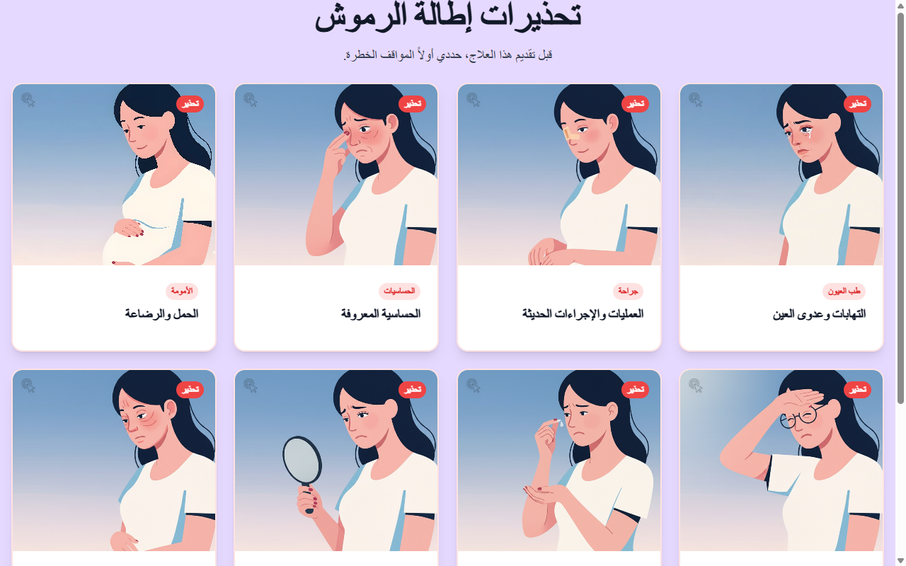

# تطبيق إطالة الرموش — Lash Extensions (AR) Slide 8

**Course:** Lash Extensions (AR)  
**Slide:** 8  
**Live URL:** https://ndnd.edtechiecorp.com  
**Stack:** Next.js · Tailwind CSS · TypeScript · GitHub Pages  

## What this slide does

Advanced Arabic-language lash extension technique content, covering the practical application steps for attaching individual lash extensions. Presented in right-to-left Arabic layout, this slide targets Arabic-speaking learners who are progressing through the technical portion of the lash extension course. At slide 8, learners are working through detailed technique content after covering theory and morphology in earlier slides.

## Screenshot

## Usage

This slide is embedded as an iframe inside Coassemble at the live URL above. DNS is managed via Cloudflare (`edtechiecorp.com`). To update the slide, push to the `main` branch — GitHub Actions will rebuild and redeploy automatically.
